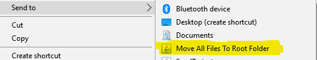

# SendTo-Move-All-Files-To-Root-Folder

This is a simple Java tool to move or copy or delete files from one or more folders that send by Windows' SendTo function.
***
# installation
Download or Build the .jar file. Place it in somewhere you want to place. Create a shortcut. Edit the shortcut: 1.Add prefix "java -jar " to "Target". 2 Delete the content of "Start in". Finally, copy the shortcut to SendTo folder(shell:sendto).  
***
After the installation, you can see SendTo-Move-All-Files-To-Root-Folder in "sent to ..." in pop-menu.  

